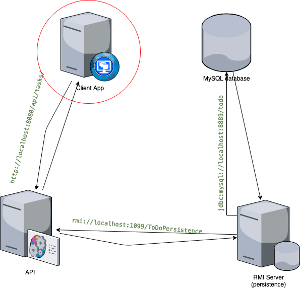

# ToDo

This is a simple Todo-list application built using angular used as an example of 
client application of a 3-tier architecture. It consumes a restful Web service to 
list and add tasks.

This application depends on this [API](https://github.com/konaesan/ToDO-API) 
which exposes the services via `http://localhost:8080/api/tasks/` and this 
[RMI server](https://github.com/konaesan/ToDo-Persistence) 
that manages the data in a MySql database.

